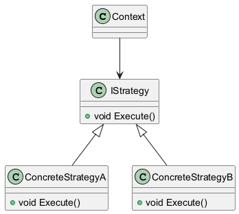
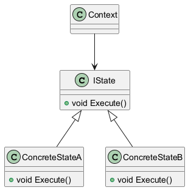
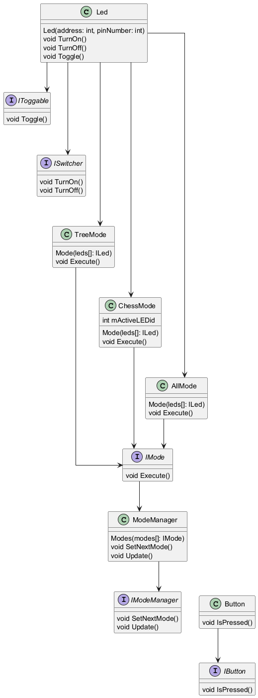

= Отчет №4
:toc:
:toc-title: Оглавление
:toclevels: 3
:sectnums:

include::titul.adoc[]

== Что такое операционная система

Операционная система — это программа, которая помогает пользователю и прикладным приложениям взаимодействовать с «железом» — памятью, процессором, файлами и периферией.

=== Основные функции ОС

|===
| Функция | Что делает

| Управление процессором | Определяет, какая задача сейчас будет выполняться
| Работа с памятью        | Выделяет и освобождает оперативную память
| Файловая система        | Обеспечивает создание, запись и чтение файлов
| Ввод/вывод              | Настраивает доступ к устройствам (например, клавиатуре или дисплею)
| Интерфейс пользователя  | Предоставляет командную строку или графический рабочий стол
|===

== Операционные системы реального времени (ОСРВ)

В таких системах особенно важно, чтобы задачи выполнялись не только правильно, но и **в нужное время**.

Если задача среагирует слишком поздно — это может привести к сбою или аварии. Поэтому в ОСРВ всё строится вокруг предсказуемости (детерминированности) и минимальных задержек.

=== Классификация ОСРВ

|===
| Тип | Особенности

| Жёсткого реального времени | Временные ограничения нарушать нельзя — например, системы в самолётах или медицинском оборудовании.
| Мягкого реального времени  | Можно немного опаздывать — например, при воспроизведении видео.
|===

== Многозадачность

Многозадачность — это когда ОС может запускать несколько задач "одновременно".

=== Виды многозадачности

* **Кооперативная** — задача сама решает, когда уступить управление.
* **Вытесняющая** — ОС сама прерывает текущую задачу, если нужно переключиться.

== Планировщик задач

Планировщик — это компонент ОС, который решает, какая задача будет выполняться в каждый момент времени.

=== На что он смотрит

* Приоритет задачи
* Время, сколько задача ждёт
* Алгоритм планирования, установленный ОС

В ОСРВ чаще всего используется *вытесняющий планировщик с приоритетами* — чтобы важные задачи всегда запускались вовремя.

=== Как работает планировщик?

Планировщик анализирует список всех задач и выбирает ту, которая *имеет самый высокий приоритет* и *готова к выполнению*. Если активная задача внезапно стала менее приоритетной, она может быть *вытеснена* планировщиком, и управление передаётся более важной задаче.

Планировщик также может учитывать другие параметры:

- таймауты ожидания (для задач, ждущих ресурс),
- случаи одинаковой приоритетности задач,
- события синхронизации (например, семафоры, очереди, флаги).

=== Когда вызывается планировщик?

Планировщик ОС вызывается в следующих случаях:

* Когда завершается текущая задача.
* Когда задача **переходит в состояние ожидания** (например, `osDelay()`, `wait()`).
* Когда **появляется задача более высокого приоритета** — например, по прерыванию.
* При **освобождении ресурса**, на который ждали другие задачи.
* При явном вызове функции планирования, если ОС это допускает (например, `taskYIELD()` в FreeRTOS).

== Что такое FreeRTOS

FreeRTOS — это маленькая и удобная операционная система реального времени, которую можно использовать в проектах с микроконтроллерами (в том числе ARM Cortex-M).

|===
| Свойство | Что это значит

| Маленький размер | Занимает минимум памяти (подходит для встраиваемых устройств)
| Гибкость | Подходит под разные микроконтроллеры
| Простота | Есть удобные функции для создания задач, очередей, мьютексов и пр.
|===

== Как задачи взаимодействуют

Когда задач несколько, они должны **обмениваться данными** и **согласовывать действия**, чтобы не мешать друг другу.

=== Механизмы взаимодействия

* Очереди
* Семафоры
* Мьютексы
* События
* Уведомления задач
* Потоки сообщений

Эти механизмы позволяют избежать конфликтов и синхронизировать работу.

== Что такое задача в FreeRTOS

Задача — это блок кода, который может выполняться отдельно от других.

* Создаётся с помощью `CreateThread()` т.е. `Rtos::CreateThread(buttonTask, "buttonTask", OsWrapper::ThreadPriority::aboveNormal);`
* У каждой задачи есть **приоритет**
* FreeRTOS переключает задачи автоматически (вытесняющая многозадачность)

[NOTE]
====
В проекте используется **специальная обёртка над FreeRTOS** — `RtosWrapper`.  
Она упрощает взаимодействие с задачами, скрывая прямые вызовы FreeRTOS API и делая код более читаемым и переносимым.
====

== Когда отключают планировщик и прерывания

Обычно это делают в особых случаях:

* Во время старта системы (инициализация)
* В критических секциях (где нельзя допустить переключение задач)
* Чтобы временно «заморозить» выполнение, например, при обновлении конфигурации

[NOTE]
====
Отключения должны быть **короткими**, иначе могут нарушиться временные гарантии.
====

== Мьютексы и защита ресурсов

Мьютекс — это механизм, который **гарантирует, что только одна задача в конкретный момент получит доступ к какому-то ресурсу** (например, к UART или файлу).

Преимущества мьютексов:

* Только один "владелец" в конкретный момент
* Поддержка **наследования приоритета** — чтобы избежать приоритетного инверсирования
* Возможность создания **рекурсивных мьютексов**, если одна и та же задача несколько раз захватывает ресурс

== Что такое дедлок (Deadlock)

Дедлок — это ситуация, когда несколько задач ждут друг друга бесконечно и ничего не происходит.

=== Причины дедлоков

* Задачи захватывают ресурсы в разном порядке
* Не освобождают ресурсы вовремя
* Используют вложенные блокировки без контроля

=== Как избежать

* Использовать **тайм-ауты** при попытке захвата ресурса
* Соблюдать **одинаковый порядок** обращения к ресурсам
* Избегать вложенных `lock`-ов, если в них нет необходимости

== Архитектура программы управления светодиодами

Программа предназначена для управления светодиодами в различных режимах работы. Количество режимов `N` и количество светодиодов в каждом режиме `M` не фиксированы — их можно настраивать. При этом цель архитектуры — позволить добавлять новые режимы и светодиоды **без необходимости изменять существующий код**.

=== Постановка задачи

* Необходимо управлять несколькими режимами работы светодиодов.
* Каждый режим может задействовать любое количество светодиодов.
* Светодиоды могут быть подключены к разным портам.
* Переключение режимов выполняется по нажатию кнопки.
* Архитектура должна обеспечивать лёгкость расширения без модификации основной логики.

=== Используемая архитектура

Для решения задачи разработана модульная архитектура, основанная на интерфейсах и шаблонах проектирования.

* Интерфейс `IMode` содержит единственный метод `Execute()` — точка входа для выполнения режима.
* Интерфейсы `IToggable` и `ISwitcher` реализуют действия со светодиодами:

  - `IToggable` — для переключения состояния (вкл/выкл),
  - `ISwitcher` — для прямого управления включением и выключением.

Режимы реализуются в виде отдельных классов, наследующих `IMode`. Управление режимами выполняется через `ModeManager`, который по нажатию кнопки переключает активный режим. Конфигурация светодиодов и режимов задаётся в отдельном файле `appconfig.h`, что позволяет добавлять светодиоды **без изменения кода**.

=== Используемые шаблоны проектирования

В проекте применяются два шаблона:

* **Стратегия (Strategy)** — для выбора конкретного режима выполнения (`IMode` и его реализации).
* **Состояние (State)** — для реализации переходов между режимами с сохранением поведения.

Оба шаблона схожи по структуре, и в проекте используется именно `Strategy`, так как режимы независимы и не содержат внутреннего состояния, влияющего на логику перехода.

=== Расширение с использованием ОСРВ

Для повышения модульности и возможности одновременного выполнения нескольких задач, была добавлена операционная система реального времени (RTOS).

Программа теперь состоит из трёх **независимых задач**:

1. **Задача опроса кнопки** — отслеживает нажатие и сообщает об этом.
2. **Задача управления режимом светодиодов** — вызывает `Execute()` текущего режима.
3. **Задача измерения температуры** — отвечает за сбор и фильтрацию данных с датчика.

Благодаря RTOS, эти задачи работают параллельно и не зависят друг от друга. Все настройки светодиодов по-прежнему хранятся в `appconfig.h`.

[NOTE]
====
Например, у разных пользователей платы может быть разное количество светодиодов — достаточно изменить конфигурацию в одном месте, без затрагивания кода.
====

=== UML-диаграммы

В проекте реализованы структуры по шаблонам **"Стратегия"** и **"Состояние"**. Ниже представлены соответствующие UML-диаграммы:

== Выводы

На этой лабораторной я познакомилась с основами работы операционных систем реального времени и поняла:

* Чем отличаются жёсткие и мягкие ОСРВ;
* Как устроен планировщик и какие бывают типы многозадачности;
* Зачем нужны мьютексы и семафоры;
* Что такое дедлок и как его избежать;
* Почему точность выполнения задач — важнейшее требование к любой RTOS.
* Мною был написан полноценный большой проект для микроконтроллера.
